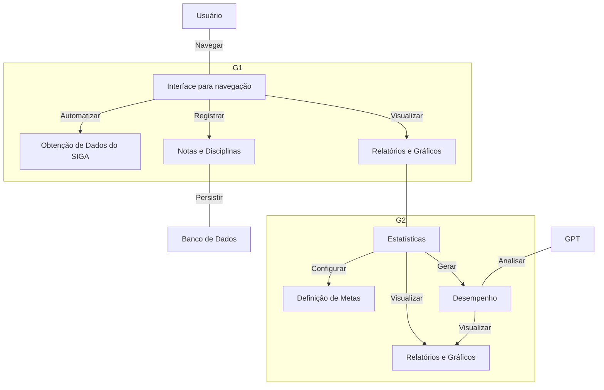
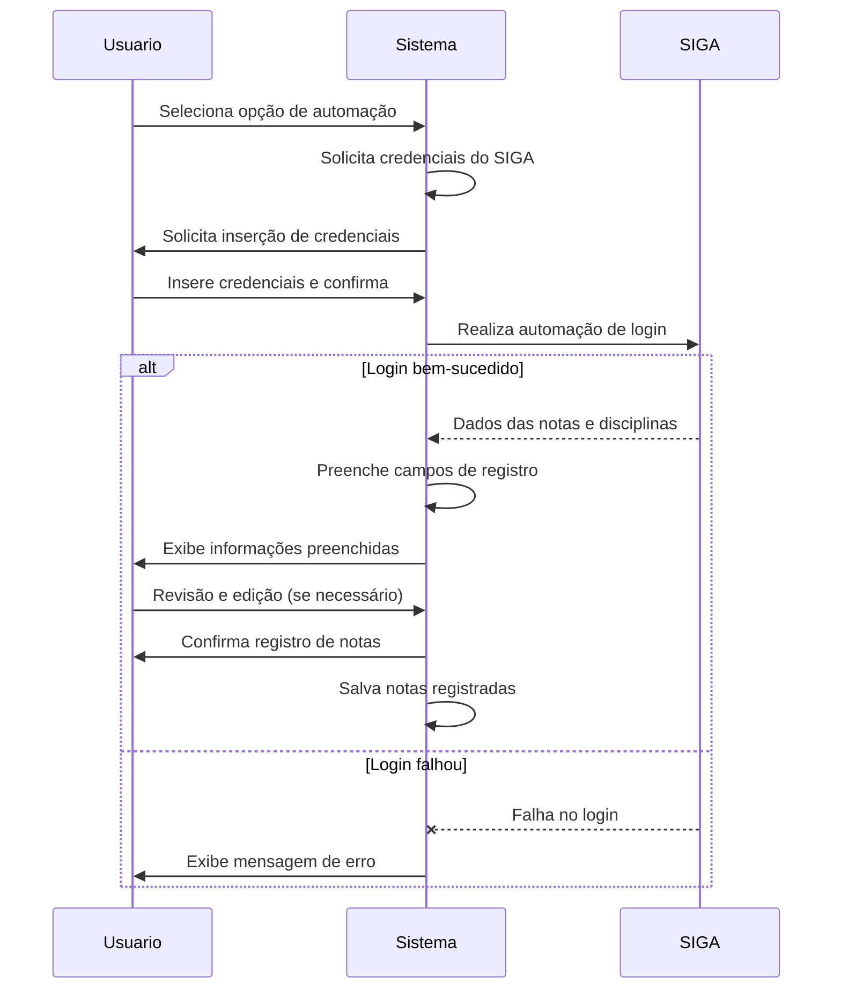
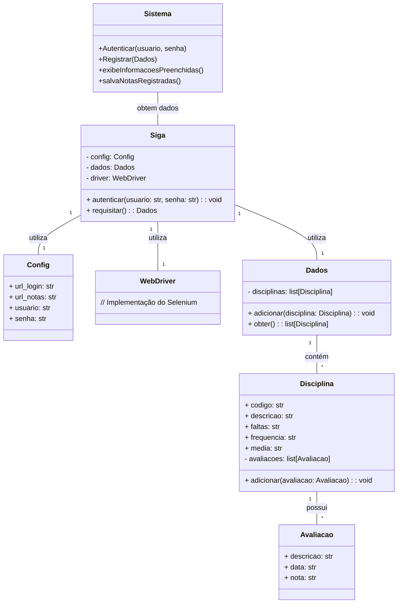
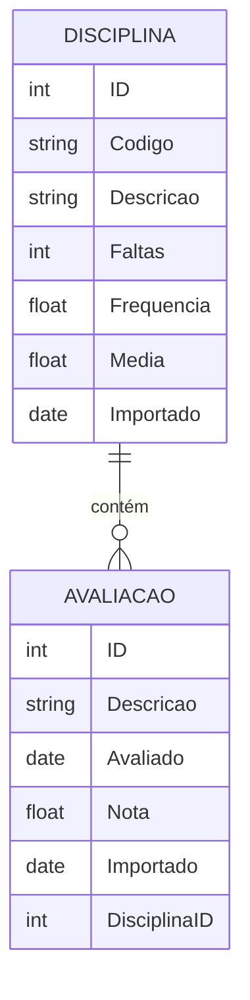

# Diagramas do Fatec-Monitor

## 1. Tabela de Requisitos

| Requisito | Grupo | Descrição | Concluído |
| --: | :-: | :-- | :-: |
| In1 | Interface | Interface para navegação dos recursos básicos | - |
| Re1 | Registro | Automatizar Obtenção de Dados do SIGA | :white_check_mark: |
| Re2 | Registro | Registrar nota em disciplinas do curso | - |
| Re3 | Registro | Armazenamento seguro e persistente das informações | - |
| Re4 | Registro | Suporte para múltiplos cursos e semestres | - |
| Ca1 | Cálculo | Cálculo de média por disciplina | - |
| Ca2 | Cálculo | Cálculo de média geral do curso | - |
| Cl1 | Calendário | Notificações ou lembretes para prazos e atividades importantes | - |
| Cl2 | Calendário | Integração com calendário acadêmico para monitorar prazos de projetos e provas | - |
| Pr1 | Progresso | Acompanhamento do desempenho acadêmico ao longo do tempo | - |
| Pr2 | Progresso | Geração de estatísticas, como média, desvio padrão, etc. | - |
| An1 | Análise | Geração de relatórios personalizados | - |
| An2 | Análise | Visualização de gráficos e representações visuais dos dados | - |
| Q1 | Qualidade | Tratamento de exceções e validação de entrada de dados | - |
| M1 | Metas | Capacidade de definir metas de desempenho e rastrear o progresso em relação a elas | - |
| Ia1 | Inteligência | Funcionalidade de Feedback e sugestões baseados nas informações extraídas e submetidas ao GPT| - |
| Op1 | Opcional | Interface amigável e intuitiva | :x: |
| Op2 | Opcional | Configurações personalizáveis, como pesos de notas, critérios de aprovação, etc. | - |
| Op3 | Opcional | Importação e exportação de dados em formatos comuns (CSV, por exemplo) | - |
| Op4 | Opcional | Compatibilidade multiplataforma, incluindo web, desktop e dispositivos móveis | - |
| Op5 | Opcional | Suporte a diferentes sistemas de avaliação, como notas numéricas, conceituais, etc. | - |
| Op6 | Opcional | Suporte a disciplinas optativas, eletivas e obrigatórias | - |
| Op7 | Opcional | Backup e recuperação de dados | - |

## 2. Casos de Uso

### 2.1. Automatizar Obtenção de Dados do SIGA

Este caso de uso descreve o processo de automação para obtenção dos dados das notas e disciplinas a partir do sistema SIGA.

#### Atores

- Usuário

#### Pré-condições

- O usuário deve estar autenticado no sistema;
- O usuário deve estar na página de registro de notas;

#### Pós-condições

- As notas são registradas no sistema;
- As informações obtidas do SIGA são armazenadas para referência futura;

#### Fluxo do Caso de Uso

## 3. Classes

## 4. Modelo ER

