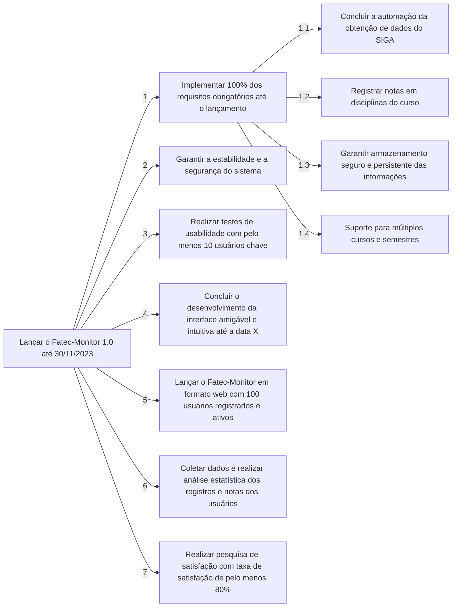

# Planejamento OKR do Projeto

```mermaid
graph LR
    A[Lançar o Fatec-Monitor 1.0 até 30/11/2023]
    B[Implementar 100% dos requisitos obrigatórios até o lançamento]
    C[Garantir a estabilidade e a segurança do sistema]
    D[Realizar testes de usabilidade com pelo menos 10 usuários-chave]
    E[Concluir o desenvolvimento da interface amigável e intuitiva até a data X]
    F[Lançar o Fatec-Monitor em formato web com 100 usuários registrados e ativos]
    G[Coletar dados e realizar análise estatística dos registros e notas dos usuários]
    H[Realizar pesquisa de satisfação com taxa de satisfação de pelo menos 80%]

    I[Concluir a automação da obtenção de dados do SIGA]
    J[Registrar notas em disciplinas do curso]
    K[Garantir armazenamento seguro e persistente das informações]
    L[Suporte para múltiplos cursos e semestres]


    A -->|1| B
    A -->|2| C
    A -->|3| D
    A -->|4| E
    A -->|5| F
    A -->|6| G
    A -->|7| H

    B -->|1.1| I
    B -->|1.2| J
    B -->|1.3| K
    B -->|1.4| L


```
